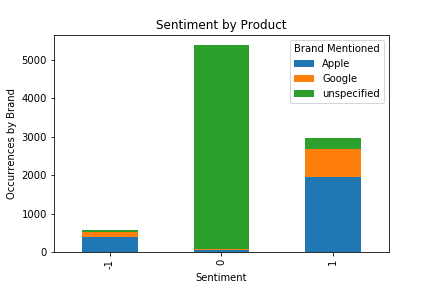

# Twitter Sentiment Analysis with Natural Language Processing

**Author**: [Christie Sarver](mailto:christie.sarver@gmail.com)

## Overview

The goal of this project is to build a model that can classify the sentiment of a tweet based on its contents. This is a multiclass problem, where sentiments are either negative, positive, or neutral. 

The data was manually labeled for classification, and contains the tweet text, the product or brand mentioned, and the sentiment as interpreted by the labeler.

### The Data

The data used is sourced from Twitter from SXSW 2013, and contains tweets about the SXSW tech events and product announcements. Most of the tweets are about Apple and Google products, so I will analyze sentiment for each brand. The raw data can be found in the data folder in this repository.

The data presented a challenge in terms of class imbalance; the majority of the data was labeled as 'neutral', leaving a relatively small amount of samples that indicated actual sentiment, positive or negative. 



### Business Problem

The resulting model will be used to classify tweets from future tech conferences from Google and Apple, and analyze how sentiment for the brands has changed over time.

## Methodology 

A variety of pre-processing and modeling techniques were explored in order to effectively transform the text data and build a strong classifier. Model performance was evaluated on accuracy scores to suit the business goal of building an accurate model for future use.  

Preprocessing included:

* Data cleaning and exploration to sort into relevant categories
* Tokenization of words and removal of stop words and grammar. Twitter handles and URLs were also removed
* Vectorization of text data using diffent strategies such as Count Vectorization and TF-IDF

Model types explored were:

* Bayesian Classifiers
* Support Vector Machines
* Neural Nets

## Results - update

Based on the model evaluations which are detailed in the notebook, the final model chosen to move forward with is a boosted method using Adaboost. The strenghts of this model include its high recall score as compared to others and overall high accuracy.

Areas where the model could be improved include reducing overall error as shown in the confusion matrix below.


### Conclusions & Future Work

This data set presented the challenge of a pretty extreme class imbalance. Since the majority of samples were labeled as neutral, there were fewer indicators of sentiment.

The classifiers typically used for text data don't have as many hyper-parameters that can be tuned to correct for class imbalance. Compliment Naive Bayes was applied to help with this, and and SVM model was used in hopes of reducing overfitting. However the most satisfactory results came from the neural net.

In order to improve this model and make in more generalizable, it is recommended to gather more data that has a higher percentage of labels that indicate positive or negative sentiment. Adding more data could also allow the use of a simpler neural net model, which could help to reduce runtimes.

## For More Information - update

Please reference the [Jupyter Notebook](./Final%20Notebook.ipynb) or review this [presentation](./Data%20Classification%20Presentation.pdf).

## Repository Structure - update

```
├── Archive
├── Images
├── Data
├── Final Notebook.ipynb
├── Sentiment Analysis with Twitter NLP.pdf
├── README.md

```
Thank you!
